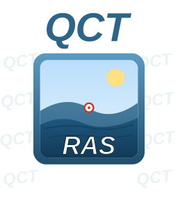

<div align="center">
  

  # QCT HEC-RAS Manager
  **A complete HEC-RAS 2D workflow plugin for QGIS**

  [](https://qgis.org)
  [](https://www.hec.usace.army.mil/software/hec-ras/)
  [](https://python.org)
  [](LICENSE)
  [](https://github.com/QCivilTools/QCivilTools-HEC-RAS-manager/releases)
</div>

---

Browse projects, edit plans, run simulations, load flood results, extract flow hydrographs, and animate time steps — all inside QGIS, without opening HEC-RAS.

## Features

| Tab | Name | What it does |
|-----|------|-------------|
| 1 | **Project Browser** | Load `.prj` projects, auto-detect result HDFs, auto-sync QGIS CRS to model CRS |
| 2 | **Plan Editor** | Edit raw `.pXX` plan files; configure HDF5 output variables via a checklist mirroring HEC-RAS's *Output Control Options → HDF5 Write Parameters* dialog |
| 3 | **Run Manager** | Sequential or parallel runs via RAS Commander or direct `Ras.exe`; per-plan core-count control |
| 4 | **Result Viewer** | Load Depth, WSE, Velocity, or Bed Level as point or cell-mesh QGIS layers; load terrain from `.rasmap`; launch RAS Mapper |
| 5 | **Animate** | Step through all timesteps live on the QGIS canvas with colour-ramped cell-mesh layer |
| 6 | **Postprocess** | Extract and plot flow hydrographs at drawn cross-sections, reference lines, or SA/2D connections; save PNG/CSV |
| 7 | **Log** | Full colour-coded activity log |

### Result Viewer
- **Variables**: Depth (WSE − terrain), Water Surface Elevation, Velocity (face-averaged), Bed Level (static terrain)
- **Output types**: 3D point layer per cell centroid (fast), or exact HDF cell boundary polygon mesh
- **Colour ramps**: Blues 0–3 m (depth); RdYlBu 0–10 m/s (velocity); both use explicit class breaks for accurate colour rendering
- **Dry-cell masking**: default 0.003 m threshold matching HEC-RAS's own Cell Volume Tolerance
- **Terrain loading**: reads `<Terrains>` node from `.rasmap`, automatically substitutes `.hdf` index files with their GDAL-readable `.vrt` sibling

### Flow Hydrograph (Postprocess tab)
Matches RAS Mapper's own *Profile Line → Plot Flow* calculation:

1. **Priority 1 — Direct sum**: `Q = ΣQ_face` if `Face Flow` is stored in the HDF (most accurate, no calculation)
2. **Priority 2 — Official method**: `Q = Σ(V_face × A_face)` using HEC-RAS's own precomputed Face Area hydraulic property table evaluated at `Face Water Surface` — the same method RAS Mapper uses internally
3. **Priority 3 — Fallback approximation**: `Q = Σ(V_f × h_f × W_f)` using adjacent-cell WSE; only used if the Face Area table or Face Water Surface is absent from the HDF; clearly flagged in the log

**Sign convention**: positive flow passes left-to-right looking in the direction you drew the line (matching HEC-RAS official convention).

> **Note**: All velocity calculations use `Face Velocity` (normal-to-face component, always present in standard 2D output). The optional `Face Point (Node) Velocities*` dataset is deliberately not used — per the HEC-RAS 2D Reference Manual it is unreliable at wet-dry boundaries (e.g. dry levee-crest nodes report the higher of adjacent cells' velocities rather than a true average) and is not used by RAS Mapper for any mapping.

### Animation
- Loads all timesteps for a variable into a GeoPackage-backed cell-mesh polygon layer
- Live per-frame attribute update using `QgsRuleBasedRenderer` (evaluates filter expressions per render call — correctly updates colour ramps during animation unlike a graduated renderer)
- Timestamps parsed from HDF in multiple formats; falls back to hour-offset computation from simulation start date
- Frame rate and timestep step-size controls

### Plan Editor — HDF5 Output Variables
A checklist mirroring HEC-RAS's *Output Control Options → HDF5 Write Parameters* dialog, grouped into Cell / Face / Advanced categories. Confirmed key syntax from real `.pXX` files:

```
HDF Additional Output Variable=Face Flow
HDF Additional Output Variable=Face Area
HDF Additional Output Variable=Face Water Surface
```

Each checked variable is its own line; unchecked variables are simply absent (no bitmask). Variables relevant to this plugin are annotated directly in the checklist. **These settings have zero effect on the computed hydraulics** — they only control which additional derived quantities are written to the output HDF for post-processing.

---

## Requirements

| Component | Version | Notes |
|-----------|---------|-------|
| QGIS | 3.16+ | Tested on 3.36–3.44, Windows |
| Python | 3.12 | Bundled with QGIS |
| h5py | 3.x | **Must install** — see below |
| HEC-RAS | 6.x / 7.x 64-bit | Only needed to *run* simulations; result viewing works without it |
| RAS Commander | latest | Optional — needed for parallel runs only |

### Install dependencies

Open **OSGeo4W Shell** (Start menu → search "OSGeo4W Shell") and run:

```bash
# Required — HDF5 file reading
pip install h5py

# Optional — enables parallel plan runs in Run Manager
pip install ras-commander
```

NumPy and SciPy are bundled with QGIS and need no separate install.

---

## Installation

### From ZIP (recommended)

1. Download `qct_hecras_manager_v1.0.0.zip` from [Releases](https://github.com/QCivilTools/QCivilTools-HEC-RAS-manager/releases)
2. In QGIS: **Plugins ▸ Manage and Install Plugins… ▸ Install from ZIP**
3. Browse to the downloaded ZIP → **Install Plugin**
4. The plugin appears under **QCivilTools ▸ HEC-RAS Manager** and as a 🌊 toolbar button

### Manual install

Copy the `qct_hecras` folder to:

```
%APPDATA%\QGIS\QGIS3\profiles\default\python\plugins\qct_hecras\
```


### Reinstalling / updating

When reinstalling a new version, QGIS may run stale `.pyc` bytecode. To force a clean load:

1. **Plugins ▸ Manage and Install Plugins** → find *QCT HEC-RAS Manager* → **Uninstall**
2. Close QGIS completely
3. Reopen QGIS → Install from ZIP again

The plugin nukes `__pycache__` on every `classFactory()` call to prevent this automatically.

---

## Quick Start

```
1. Tab 1  → Browse to a .prj file or folder → project loads and CRS auto-syncs
2. Tab 2  → (optional) Configure HDF5 output variables for next run
3. Tab 3  → Tick plans → Run Selected Plans
4. Tab 4  → Select plan → Variable → Time step → Load to QGIS
5. Tab 5  → Load variable → Play to animate over time
6. Tab 6  → Select plan/area → Draw cross-section on map → 📊 Plot
```

---

## HEC-RAS Compatibility

| Feature | HEC-RAS 6.x | HEC-RAS 7.x |
|---------|------------|------------|
| Project / plan browsing | ✅ | ✅ |
| Result Viewer (Depth, WSE, Velocity) | ✅ | ✅ |
| Animation | ✅ | ✅ |
| Flow Hydrograph — Priority 1 (Face Flow) | If enabled in Output Options | If enabled in Output Options |
| Flow Hydrograph — Priority 2 (V×A table) | ✅ | ✅ |
| Plan runner via Ras.exe | ✅ | ✅ |
| Plan runner via RAS Commander | ✅ | ✅ |


---

## Troubleshooting

| Symptom | Fix |
|---------|-----|
| *"h5py not available"* | `pip install h5py` in OSGeo4W Shell, then restart QGIS |
| Run fails exit code 1 | RAS Executable path wrong — use Auto-find or paste full path to 64-bit `Ras.exe` |
| Blank / empty result layer | Lower dry threshold or untick *Remove dry cells* |
| COM bitness error | Expected — use **RAS Executable** engine instead of RAS Controller |
| Cross-section bbox mismatch | CRS mismatch — plugin auto-syncs project CRS on load; check Log tab for coordinate-magnitude hints |
| Flow hydrograph shows only Priority 3 | Enable `Face Flow`, `Face Area`, and `Face Water Surface` in Plan Editor → HDF5 Output Variables, then re-run the plan |
| Terrain loads as blank | `.vrt` sibling not found next to `Terrain.hdf` — open RAS Mapper once to regenerate it, or load source GeoTIFF manually |
| Stale code after reinstall | Disable → re-enable in Plugin Manager; or manually delete `__pycache__` in the plugin folder |
| RAS Commander "Verifying SciChart" dialog | One-time DLL licence check — select any writable folder and click OK; won't reappear |

---

## Project structure

```
qct_hecras/
├── __init__.py            # Plugin entry point; nukes __pycache__ on every load
├── plugin.py              # Registers menu/toolbar actions
├── hecras_dialog.py       # Main dialog — all 7 tabs (~4 000 lines)
├── plan_hdf_raster.py     # HDF → QGIS layer conversion (point, cell mesh, raster)
├── hecras_reader.py       # .prj / .pXX parser
├── hecras_runner.py       # Plan execution (RAS Commander / Ras.exe)
├── rasmap_reader.py       # .rasmap XML parser (stored maps, terrains)
├── postprocessing_reader.py # Post-processing HDF reader
├── ras_hdf_reader.py      # Low-level HDF5 utilities
├── icon.png               # Plugin icon (256 px)
├── icons/                 # Standard sizes: 16, 24, 32, 48, 64, 128, 256 px
└── metadata.txt           # QGIS plugin metadata
```


---

## Acknowledgements

- [HEC-RAS](https://www.hec.usace.army.mil/software/hec-ras/) — US Army Corps of Engineers Hydrologic Engineering Center
- [RAS Commander](https://github.com/billk-FM/HEC-Commander) — Python orchestration library for HEC-RAS
- [h5py](https://www.h5py.org/) — HDF5 for Python
- [QGIS](https://qgis.org) — Open-source GIS platform

---

## License

MIT License — see [LICENSE](LICENSE) for details.

---

<div align="center">
  <sub>Part of the <a href="https://github.com/QCivilTools">QCivilTools</a> suite for QGIS · Built for civil and hydraulic engineering in New Zealand</sub>
</div>
